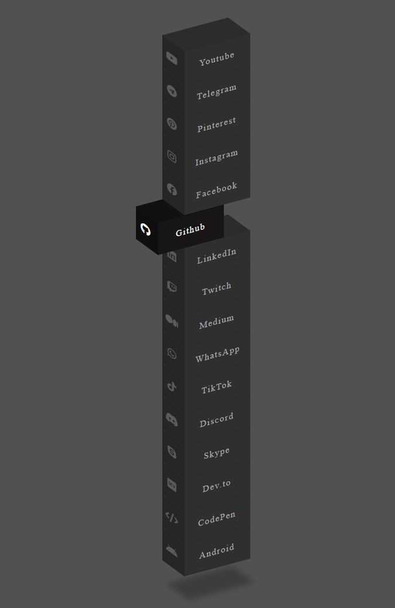

# 🌟 Menú Isométrico 3D de Redes Sociales

Un elegante menú interactivo de redes sociales con efectos de hover en 3D, creado utilizando CSS puro. El menú presenta una disposición isométrica única con animaciones suaves y efectos visuales atractivos.



## ✨ Características

- Diseño isométrico 3D con perspectiva dinámica
- Animaciones suaves al pasar el mouse
- Efectos de hover personalizados para cada red social
- Más de 15 redes sociales populares incluidas
- Diseño totalmente responsive
- Iconografía de Font Awesome
- Código limpio y bien comentado
- Fácil de personalizar y extender

## 🛠️ Tecnologías Utilizadas

- HTML5 para la estructura
- CSS3 para los estilos y animaciones
  - Transformaciones 3D
  - Variables CSS
  - Flex layout
- Font Awesome 6.1.1 para iconos

## 📦 Instalación

1. Clona este repositorio:
```bash
git clone https://github.com/gianmattus-programmer/MENU-REDES-SOCIALES-3D
```

2. Abre el archivo `index.html` en tu navegador

## 🎨 Personalización

Para añadir una nueva red social:

1. Añade un nuevo elemento `<li>` a la lista
2. Configura el índice `--i` para la posición
3. Define el color `--clr` específico de la red social
4. Incluye el ícono correspondiente de Font Awesome

Ejemplo:
```html
<li style="--i:-4;--clr:#25D366">
    <a href="#">
        <span><i class="fa-brands fa-whatsapp"></i></span>
        WhatsApp
    </a>
</li>
```

## 🌐 Navegadores Soportados

- Chrome 80+
- Firefox 75+
- Safari 13+
- Edge 80+

## 👨‍💻 Autor

Creado con ❤️ por Gianmattus-Programmer

## 📄 Licencia

Este proyecto está bajo la Licencia MIT. Ver el archivo `LICENSE` para más detalles.
